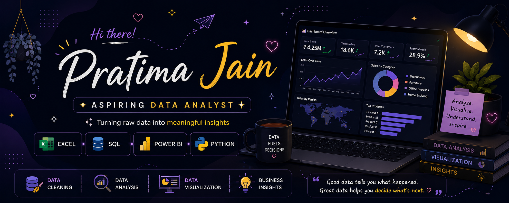

---

## 👩‍💻 About Me

🎓 Pursuing **Bachelor of Computer Applications (BCA)** with a strong interest in **Data Analytics & Business Intelligence**.

📊 Skilled in **Microsoft Excel, SQL, Power BI, Power Query, and Python** for data analysis.

📈 Passionate about transforming raw data into **interactive dashboards and meaningful business insights**.

🚀 Built hands-on projects using **Power BI, Excel, and SQL** through academic and self-driven learning.

🌱 Currently learning **Advanced SQL, DAX, Python for Data Analytics, and Statistics**.

🤝 Open to **Data Analyst internships, collaborations, and learning opportunities**.

---

## 🛠️ Tech Stack

### 📊 Data Analytics

  
  
  

### 💻 Programming & Database

  
  
  

### ⚙️ Tools & Platforms

  
  
  

---

## 📂 Featured Projects

📺 **Netflix Content Analysis Dashboard**
- Built an interactive Power BI dashboard with KPIs, slicers, and drill-through analysis.
- Cleaned and transformed data using Power Query.

📈 **Excel Sales Dashboard**
- Created an interactive sales dashboard using Pivot Tables, Power Query, and Lookup functions.
- Identified sales trends and business insights.

🗄️ **SQL Sales Data Management**
- Performed CRUD operations and managed sales records using SQL.
- Retrieved and organized data using SELECT, WHERE, and ORDER BY.

---

## 🌱 Currently Learning

- 📊 Advanced Power BI (DAX)
- 🐍 Python for Data Analytics
- 🗃️ Advanced SQL
- 📈 Data Storytelling & Business Intelligence

---

## 🌐 Let's Connect

  
  
  
  

---

## 🎯 Goals

- 📊 Build impactful Data Analytics projects
- 🚀 Continuously improve my analytical and problem-solving skills
- 🤝 Contribute to open-source and collaborate with the developer community
- 💼 Secure a Data Analyst internship and grow into a Business Intelligence professional

---

💡 <i>"Turning raw data into meaningful decisions."</i>

  

